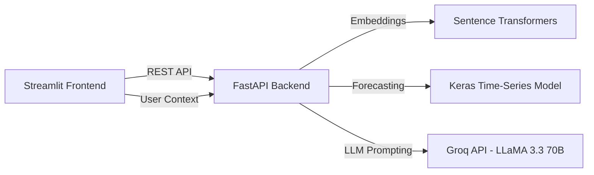

# 🎯 Gap Sense


**Gap Sense** is an AI-powered skill gap analysis and career trend prediction platform designed to help **fresh graduates and early-career professionals** measure how their current skill set compares to real industry demands. Using semantic similarity matching, personalized AI career consultation, and time-series forecasting, it delivers actionable insights tailored to each user's unique background.

---

## ✨ Key Features

| Feature | Description |
|---|---|
| **Semantic Skill Gap Analysis** | Uses `SentenceTransformers` (`all-MiniLM-L6-v2`) with cosine similarity to accurately match user skills against real job posting requirements. |
| **Personalized AI Career Consultation** | Integrates **Groq API (LLaMA 3.3 70B Versatile)** with contextual prompts that adapt to user's experience level, learning background, and timeline. |
| **Role-Aware Noise Filtering** | Applies importance thresholds (`≥ 0.25`) and role-specific forbidden keyword lists to eliminate irrelevant skill recommendations (e.g., no Python for Frontend). |
| **Skill Trend Forecasting** | Employs a trained Keras Dense NN model to predict next-month demand for specific skills based on historical job posting data. |
| **Interactive Visualizations** | Single-chart trend viewer with dropdown selector, recommendation progress bars, and accordion-style AI explanations — all in a premium dark-mode UI. |
| **Score Interpretation** | Contextual labels (🌱 Tahap Awal → 🏆 Expert-Ready) help users understand what their score means relative to their career stage. |
| **Dynamic Project Recommender** | Suggests exactly 3 robust, highly-tailored portfolio projects to build based on the user's specific matched skills combining _difflib_ and Content-based filtering (`project_recommender.py`). |

---

## 🏗 System Architecture



### Data Flow

1. **User Input** → Role, skills, experience level, learning background, timeline
2. **Normalization** → Input cleaned via regex, alias mapping, and soft-skill filtering (`norm_input.py`)
3. **Gap Analysis** → Cosine similarity + importance scoring + role-based noise filtering (`model_gap.py`)
4. **AI Generation** → Personalized per-skill explanations + career roadmap conclusion (`explanation.py`)
5. **Trend Prediction** → Historical demand data + next-month forecast (`trend_model.py`)
6. **Project Recommender** → Match user skills against industry-standard projects to recommend exact portfolio steps (`project_recommender.py`)
7. **Presentation** → Interactive dashboard with accordion, charts, dynamic recommendation cards, and contextual scoring (`app_streamlit.py`)

## 📂 Repository Architecture (2-Branch System)

To maintain a clean separation of concerns and enable seamless "zero-budget" deployments, this project is divided into two distinct branches. **You must switch branches to view the specific codebase:**

### Branch 1: `front-end` (Streamlit UI)
Contains only the web interface code. Deployed directly to **Streamlit Community Cloud**.
```text
(front-end branch)
.
├── app_streamlit.py           # Streamlit UI, interactive charts
├── .env                       # Frontend environment variables
├── requirements.txt           # Frontend dependencies (Streamlit, Plotly, etc.)
└── README.md
```

### Branch 2: `skill_gap_model` (FastAPI Backend)
Contains the core machine learning models, API, and datasets. Deployed to **Hugging Face Spaces**.
```text
(skill_gap_model branch)
.
├── modeling/                  # Core application logic
│   ├── data/                  # Keras model (.keras) & trend dataset (.csv)
│   ├── services/              # ML logic & Groq Prompting
│   ├── main.py                # FastAPI entry point
│   └── .env                   # Environment variables (GROQ_API_KEY)
├── Preprocessing data/        # SkLearn Vocabs (.pkl) and datasets
├── requirements.txt           # Backend dependencies (FastAPI, TensorFlow, etc.)
└── Dockerfile                 # Hugging Face deployment config
```

---

## 📦 Key Dependencies

### Backend (`Capstone-AI Model/requirements.txt`)
| Package | Purpose |
|---|---|
| `fastapi` + `uvicorn` | REST API gateway |
| `sentence-transformers` | Semantic embeddings (all-MiniLM-L6-v2) |
| `tensorflow` / `keras` | Time-series demand forecasting |
| `groq` | LLM API client (LLaMA 3.3 70B) |
| `pandas` + `scikit-learn` | Data manipulation & cosine similarity |
| `arima` | Time series forecasting for skill trend prediction |

### Frontend (`Capstone-Frontend/requirements.txt`)
| Package | Purpose |
|---|---|
| `streamlit` | Web UI dashboard |
| `plotly` | Interactive trend charts |
| `requests` | HTTP API client |

---

## 🛠 Installation & Setup

### Prerequisites
- Python 3.10 or higher
- [Groq API Key](https://console.groq.com/keys) (Free tier)

### 1. Clone the Repository
```bash
git clone <repository-url>
cd "Capstone-Project-Dicoding"
```

### 2. Setup FastAPI Backend (Branch: `skill_gap_model`)
Checkout the AI model branch:
```bash
git checkout skill_gap_model
python -m venv .venv

# Windows
.venv\Scripts\activate
# macOS/Linux
source .venv/bin/activate

pip install -r requirements.txt
```

Create a `.env` file in the `modeling/` directory:
```env
GROQ_API_KEY=your_groq_api_key_here
```

Run the backend server:
```bash
cd modeling
python main.py
```
> The API will be hosted at: **http://localhost:8000** (Swagger UI: `/docs`)

### 3. Setup Streamlit Frontend (Branch: `front-end`)
Open a **new terminal window** and checkout the frontend branch:
```bash
git checkout front-end
python -m venv venv

# Windows
venv\Scripts\activate
# macOS/Linux
source venv/bin/activate

pip install -r requirements.txt
```

Create a `.env` file in the root of the frontend branch:
```env
BACKEND_API_URL=http://localhost:8000
```

Run the frontend:
```bash
streamlit run app_streamlit.py
```
> The Web UI will be available at: **http://localhost:8501**

---

## 📡 API Reference

### `POST /api/gap-sense`
Analyze skill gap for a given role with personalized context.

**Request Body:**
```json
{
  "role": "frontend",
  "skills": ["react", "javascript", "html"],
  "top_k": 10,
  "experience_level": "fresh_graduate",
  "learning_background": "bootcamp",
  "target_timeline": "3_months"
}
```

**Response:** Gap score (%), top recommended skills with similarity/importance scores, AI explanation (per-skill), and personalized career roadmap conclusion.

### `POST /api/skill-trend`
Get historical demand trend and next-month prediction for specific skills.

**Request Body:**
```json
{
  "skills": ["node.js", "typescript", "vite"]
}
```

**Response:** Monthly historical counts and predicted next-month demand per skill.

### `GET /api/health`
Health check — returns model loading status.

---

## 🧠 Technical Decisions

| Decision | Rationale |
|---|---|
| **LLaMA 3.3 70B** over 8B | Significantly better reasoning, less repetitive output, and more nuanced career advice in Bahasa Indonesia. |
| **Importance threshold ≥ 0.25** | Eliminates noise from cross-role skills in the dataset (e.g., Python appearing in Frontend due to fullstack postings). |
| **Role-based forbidden keywords** | Hard filter to guarantee zero irrelevant skills slip through (e.g., no R/Numpy for Frontend). |
| **Semantic matching (cosine ≥ 0.85)** for owned skills | Handles input variations naturally (e.g., "reactjs" matches "react"). |
| **Fuzzy trend matching threshold 85%** | Prevents the trend chart from showing unrelated skills (e.g., "npm" no longer fuzzy-matches to "numpy"). |
| **User context injection** | Experience level, learning background, and timeline are injected directly into LLM prompts for personalized roadmaps. |
| **Temperature 0.3** | Balances consistency with enough variation to avoid robotic, template-like output. |

---

## 📝 Code Standards
- **Type Hinting**: Enforced across all modules (`typing.List`, `Optional`, `Dict`).
- **Google-Style Docstrings**: Applied to all classes, methods, and functions.
- **Separation of Concerns**: API routing (`main.py`) → Business logic (`services/`) → UI (`app_streamlit.py`).
- **Deduplication**: Applied at both ML pipeline level and API response level.

---

## 🗄️ Datasets

- [Data Analyst Job Postings (Pay, Skills, Benefits)](https://www.kaggle.com/datasets/lukebarousse/data-analyst-job-postings-google-search) 
- [Data Analyst Job Roles in Canada](https://www.kaggle.com/datasets/amanbhattarai695/data-analyst-job-roles-in-canada)
- [Data Science Job Postings & Skills (LinkedIn)](https://www.kaggle.com/datasets/asaniczka/data-science-job-postings-and-skills) 
- [Internshala Jobs Dataset](https://www.kaggle.com/datasets/dev122/internshala-jobs-dataset)
- [Job Descriptions 2025 – Tech & Non-Tech Roles](https://www.kaggle.com/datasets/adityarajsrv/job-descriptions-2025-tech-and-non-tech-roles) 
- [LinkedIn Data Jobs Dataset](https://www.kaggle.com/datasets/joykimaiyo18/linkedin-data-jobs-dataset)
- [Resume Dataset](https://www.kaggle.com/datasets/jithinjagadeesh/resume-dataset)
- [Skill-Based Task Assignment](https://www.kaggle.com/datasets/umerfarooq09/skill-based-task-assignment) 
- [stackoverflow survey](https://www.kaggle.com/datasets/jhotika/stackoverflow-survey)
- [Future job & skills demand 2025](https://www.kaggle.com/datasets/ahsanneural/future-jobs-and-skills-demand-2025)
- [Scraping Adzuna API (Data Live April 2026)](https://api.adzuna.com/v1/api)

---

*Group DB10-G002, Dicoding Bootcamp Batch 10 : Artificial Inteligence.*
